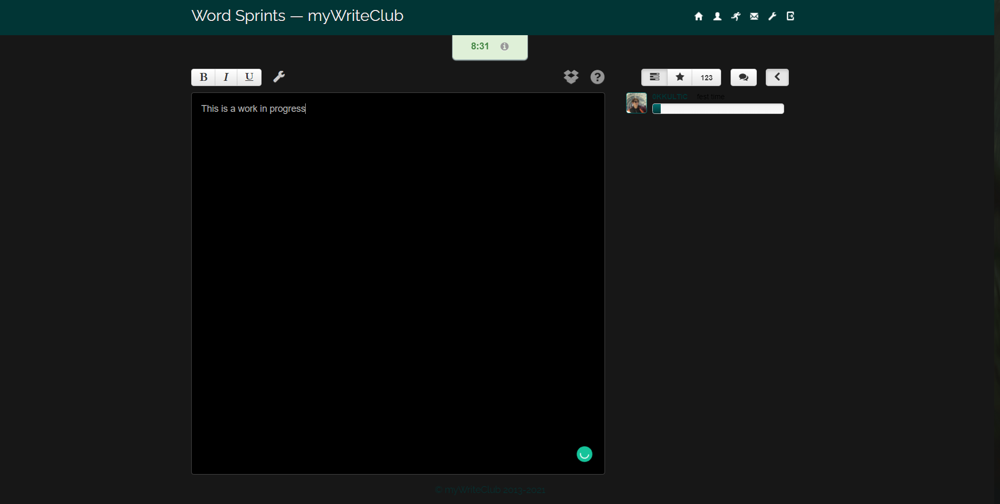

# mwc-dark-mode

Javascript that changes myWriteClub's website to have a dark mode. Can be used with an injector such as GreaseMonkey.

## To be changed
- Status text color
- Home page color
- Username color
- Progress bar colors
